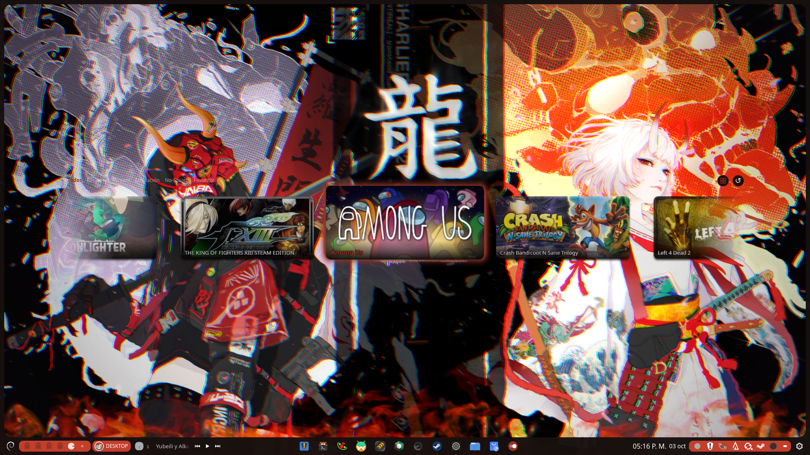
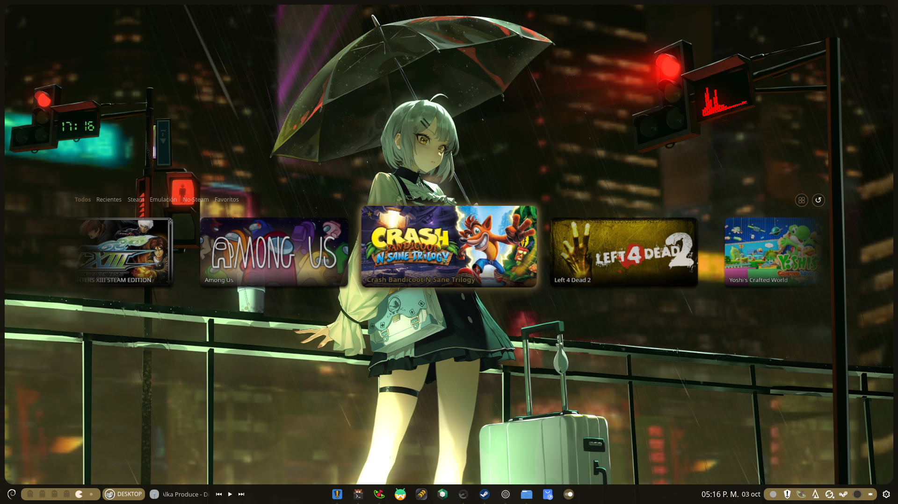
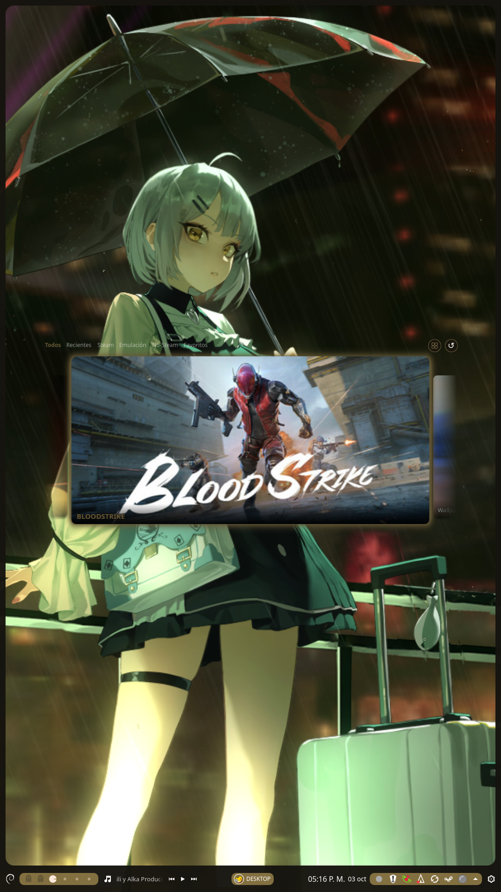
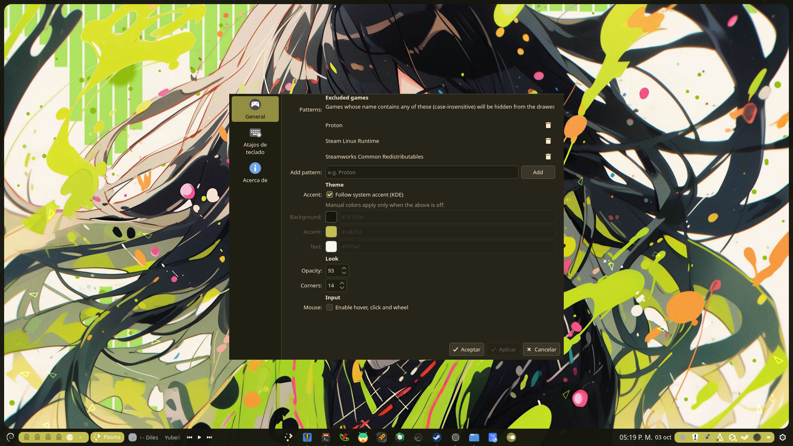

# Game Vault

Game Vault es un drawer flotante para Plasma 6 donde vive toda tu colección: tus juegos de Steam, tus ROMs emuladas y tus lanzadores externos, listos para abrir con un atajo.

- **Todo ordenado**: pestañas para Todos, Recientes, Steam, Emulación, No-Steam y Favoritos, más una categoría secreta de Ocultos. Cambias entre ellas con Tab.
- **Sin tocar el mouse**: navegas con flechas, lanzas con Enter, marcas favoritos con Ctrl+F y escondes juegos con Ctrl+O.
- **Empieza a escribir y filtra**: el buscador aparece solo y no te roba el foco.
- **Siempre primero lo último que jugaste**: el Vault recuerda qué abriste y lo pone al frente.
- **Se viste con tu escritorio**: toma el color de acento de KDE al instante, sin scripts raros. Y si prefieres, ponle tus colores a mano.
- **Tus portadas como deben verse**: usa tu portada amplia de Steam y se arregla solo si Steam mueve tus atajos.

## Capturas







## Ajustes



## Instalar

```bash
git clone https://github.com/ezku100/gamevault.git
cd gamevault
./install.sh
```

Manual: descarga el `.plasmoid` desde [Releases](https://github.com/ezku100/gamevault/releases/latest), luego clic derecho en el panel → Añadir o gestionar elementos gráficos → Obtener nuevos → Instalar desde archivo.

## Agregar al panel

1. Clic derecho en el panel (o el escritorio) → **Añadir o gestionar elementos gráficos**.
2. Busca **Game Vault** y agrégalo (puedes arrastrarlo al panel).
3. Opcional: clic derecho al icono → **Configurar** → **Atajos** → asigna un atajo global (sugerido `Meta+Ctrl+G`).
4. Si no aparece tras instalar, reinicia Plasma: `nohup plasmashell --replace >/tmp/plasmashell.log 2>&1 &`

## Atajos de teclado

| Tecla | Acción |
|---|---|
| `←` `→` `↑` `↓` | Mover selección |
| `Enter` / `Espacio` | Lanzar juego |
| `Esc` | Limpiar búsqueda → cerrar buscador → cerrar drawer |
| `Tab` / `Shift+Tab` | Siguiente / anterior categoría |
| `Ctrl+F` | Marcar / desmarcar favorito |
| `Ctrl+O` | Ocultar / mostrar juego |
| `Ctrl+H` | Abrir categoría Ocultos |
| `F5` | Reescanear biblioteca |
| Escribir | Abre el buscador y filtra |

Atajo global sugerido: `Meta+Ctrl+G` (clic derecho al widget → Configurar → Atajos).

## Créditos

- Basado en [GameDrawer](https://github.com/atopion/gamedrawer) de atopion
- Fork, categorías y estilos: ezku
- Licencia: GPLv3
